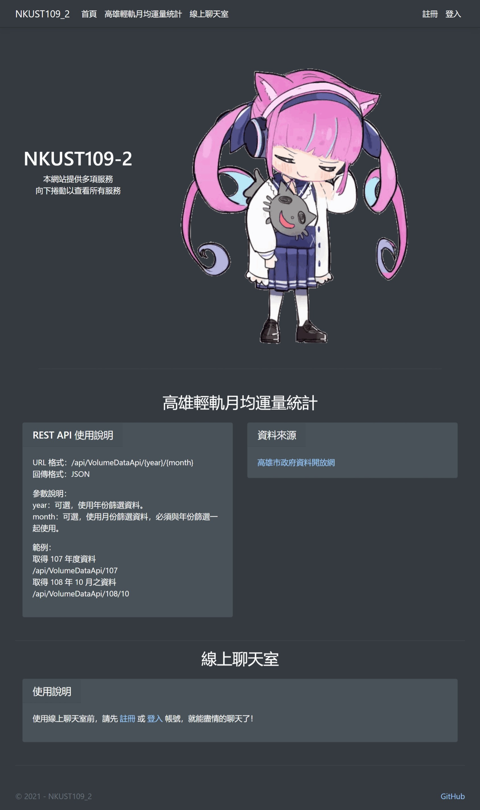

# NKUST109-2

## [Demo](http://li1696-82.members.linode.com/weikeup)

關於這次的課程，我覺得對於架設網頁後端或是 REST API 都是非常有幫助的，由於在之前有接觸過 Java Servlet 跟 Spring Boot MVC，因此還蠻容易瞭解其中的原理。我也瞭解到發展這些技術都是為了能夠更方便、更輕易的架設一套完整的系統，同時也是為了在系統逐漸變大的過程中，能夠有彈性地加入各種擴充功能，並且不失其維護性，使得在後續的維護與除錯中，能夠更有效率地完成。如果未來要做大型的後端系統，一定要導入這些技術，讓未來的開發過程能夠省時又省力！



## Target Framework
- ASP.NET Core 5.0

## Feature
### 高雄輕軌月均運量統計
將高雄市政府所公開的輕軌月均運量匯入至資料庫，並提供修改資料的界面，且增加了以年份及月份查詢資料的 REST API。  
資料來源：[高雄輕軌月均運量統計](https://data.kcg.gov.tw/dataset/6f29f6f4-2549-4473-aa90-bf60d10895dc/resource/30dfc2cf-17b5-4a40-8bb7-c511ea166bd3)

  - REST API response format
    ```json
    [
        {
            "id": Integer,
            "年": Integer,
            "月": Integer,
            "總運量": Integer,
            "日均運量": Integer,
            "假日均運量": Integer,
            "月台上刷卡日均筆數": Integer,
            "車上刷卡日均筆數": Integer,
            "售票機日均筆數": Integer,
            "補票日均筆數": Integer,
            "團體票日均筆數": Integer,
            "人工售票日均筆數": Integer,
            "備註": String
        }
    ]
    ```


### 線上聊天室
使用內建的身份驗證系統做使用者辨識，並透過與後端持續地長輪詢來更新前端資料。


## Technology used
### [MVC](https://docs.microsoft.com/zh-tw/aspnet/core/mvc/overview?view=aspnetcore-5.0)
MVC 架構，也就是 Model-View-Controller，將整個系統劃分為三個元件，當使用者向伺服器發出請求時，由 Controller 負責商業邏輯處理，並在需要時向 Model 請求資料庫中的資料，在處理完成後，將資料渲染至 View 中，並將處理完成後的 View 傳送給使用者使用。透過 MVC 架構，可以降低整個系統的耦合性，在撰寫程式的時候，能夠更好地維護與測試個別的元件，降低系統開發的難度。

### [Entity Framework](https://docs.microsoft.com/zh-tw/ef/core/)
Entity Framework 是一個常見的資料存取技術，透過使用程式語言撰寫模型，來控制資料表的結構，同時減少在做資料庫存取時，需要撰寫大量的 SQL 語法。

### [Bootstrap](https://getbootstrap.com/)
Bootstrap 是非常有名的一個用來協助網頁排版的函式庫，透過將內部預先寫好的 CSS Style 套用到 Html 標籤中，就能夠很輕易進行排版及視覺美化。同時藉由他們所設計的排版系統，能夠快速的將網頁設計成 RWD，使網頁在各種大小的螢幕中，都能以最適合的形象呈現給使用者。

### [Long Polling](https://zh.wikipedia.org/wiki/%E6%8E%A8%E9%80%81%E6%8A%80%E6%9C%AF#%E9%95%BF%E8%BD%AE%E8%AF%A2)
Long polling 是一種常見的輪詢方式，當使用者向伺服器發送請求後，如果有新的資料待傳送，則伺服器會直接回應該資料，否則會進入等待新資料產生，其中，使用者端會持續等待該請求被伺服器回傳，或是等待超時後，才再一次發送請求。此舉能夠降低使用者在伺服器沒有新資料待傳送時，短時間內重複發送請求的問題。
